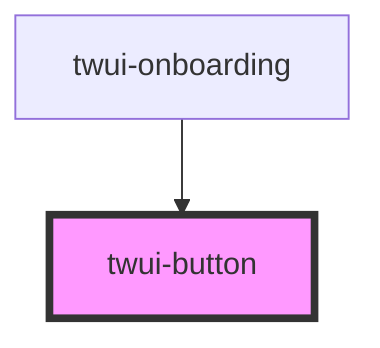

# twui-button

<!-- Auto Generated Below -->

## Properties

| Property     | Attribute    | Description | Type                       | Default     |
| ------------ | ------------ | ----------- | -------------------------- | ----------- |
| `color`      | `color`      |             | `"primary" \| "secondary"` | `'primary'` |
| `iconafter`  | `iconafter`  |             | `string`                   | `undefined` |
| `iconbefore` | `iconbefore` |             | `string`                   | `undefined` |
| `label`      | `label`      |             | `string`                   | `undefined` |
| `type`       | `type`       |             | `string`                   | `'button'`  |

## Dependencies

### Used by

 - [twui-onboarding](../../pages/onboarding)

### Graph

----------------------------------------------

*Built with [StencilJS](https://stenciljs.com/)*
