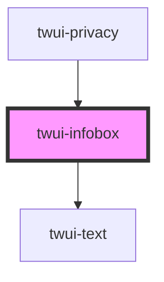

# twui-button

<!-- Auto Generated Below -->

## Properties

| Property  | Attribute | Description | Type                                | Default     |
| --------- | --------- | ----------- | ----------------------------------- | ----------- |
| `color`   | `color`   |             | `"error" \| "success" \| "warning"` | `undefined` |
| `icon`    | `icon`    |             | `string`                            | `undefined` |
| `label`   | `label`   |             | `string`                            | `undefined` |
| `message` | `message` |             | `string`                            | `undefined` |

## Dependencies

### Used by

 - [twui-privacy](../../pages/privacy)

### Depends on

- [twui-text](../text)

### Graph

----------------------------------------------

*Built with [StencilJS](https://stenciljs.com/)*
