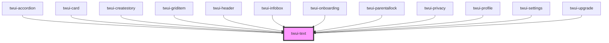

# twui-text

<!-- Auto Generated Below -->

## Properties

| Property | Attribute | Description | Type                                      | Default     |
| -------- | --------- | ----------- | ----------------------------------------- | ----------- |
| `align`  | `align`   |             | `"center" \| "right"`                     | `undefined` |
| `format` | `format`  |             | `"header" \| "secondary" \| "subheading"` | `undefined` |

## Dependencies

### Used by

 - [twui-accordion](../../organisms/accordion)
 - [twui-card](../../organisms/card)
 - [twui-createstory](../../pages/createstory)
 - [twui-griditem](../../organisms/grid/griditem)
 - [twui-header](../../organisms/header)
 - [twui-infobox](../infobox)
 - [twui-onboarding](../../pages/onboarding)
 - [twui-parentallock](../../pages/parentallock)
 - [twui-privacy](../../pages/privacy)
 - [twui-profile](../../pages/profile)
 - [twui-settings](../../pages/settings)
 - [twui-upgrade](../../pages/upgrade)

### Graph

----------------------------------------------

*Built with [StencilJS](https://stenciljs.com/)*
