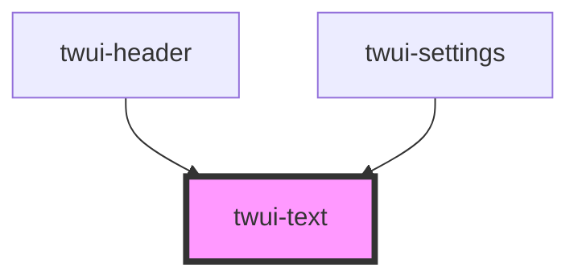

# twui-text

<!-- Auto Generated Below -->

## Properties

| Property | Attribute | Description | Type                 | Default     |
| -------- | --------- | ----------- | -------------------- | ----------- |
| `format` | `format`  |             | `"header" \| "hint"` | `undefined` |

## Dependencies

### Used by

 - [twui-header](../../organisms/header)
 - [twui-settings](../../pages/settings)

### Graph

----------------------------------------------

*Built with [StencilJS](https://stenciljs.com/)*
