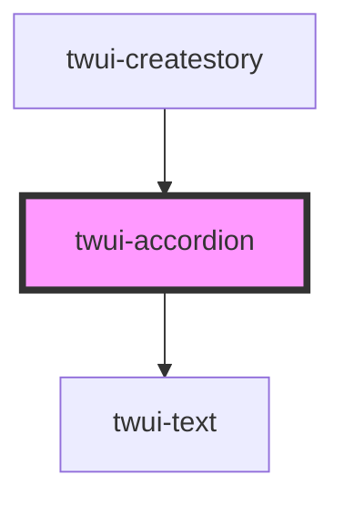

# twui-header

<!-- Auto Generated Below -->

## Properties

| Property | Attribute | Description | Type      | Default     |
| -------- | --------- | ----------- | --------- | ----------- |
| `icon`   | `icon`    |             | `string`  | `undefined` |
| `label`  | `label`   |             | `string`  | `undefined` |
| `open`   | `open`    |             | `boolean` | `false`     |

## Dependencies

### Used by

 - [twui-createstory](../../pages/createstory)

### Depends on

- [twui-text](../../molecules/text)

### Graph

----------------------------------------------

*Built with [StencilJS](https://stenciljs.com/)*
